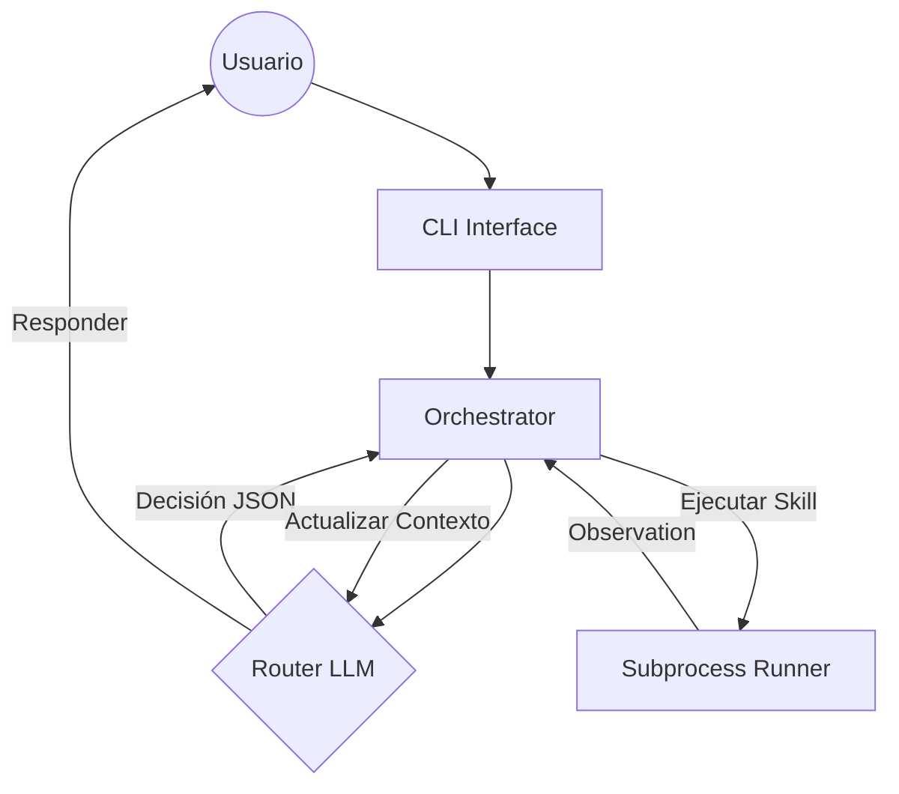

# Agent Skills POC - Clean Architecture 🚀

Prueba de Concepto (POC) para un agente de IA modular basado en **Agent Skills** y **Clean Architecture**. Diseñado para entender profundamente el modelo agentic sin depender de frameworks comerciales.

[](https://www.python.org/downloads/)
[](docs/architecture.md)
[](LICENSE)

## 🏛️ Filosofía del Proyecto

Este agente no "sabe" hacer cosas por arte de magia. Tiene capacidades declarativas llamadas **Skills** que descubre en tiempo real. Se separa estrictamente el **Razonamiento** (LLM como Router) de la **Ejecución** (Python como Orquestador).

### Flujo de Trabajo (Loop Agentic)



---

## 🧠 Características Principales

### 1. Progressive Disclosure (Context Hygiene)
Siguiendo las **Best Practices de Anthropic**, el agente solo carga la información que necesita:
- **Nivel 1**: Metadata ligera para que el Router sepa qué skills existen.
- **Nivel 2**: Instrucciones detalladas (`SKILL.md`) solo cuando se elige una habilidad.
- **Nivel 3**: Recursos profundos bajo demanda.

### 2. Integración MCP (Model Context Protocol)
El agente es capaz de hablar con herramientas externas mediante el estándar **MCP vía stdio**, permitiendo una extensibilidad infinita sin tocar el core.

### 3. Stateless & Safe
- **Cero Persistencia**: Todo el estado vive en la RAM. Ideal para privacidad y POCs rápidas.
- **Aislamiento**: Las skills corren en procesos separados para evitar fallos catastróficos.

---

## 🚀 Inicio Rápido

### 1. Instalación
Requiere [UV](https://docs.astral.sh/uv/) para la gestión de dependencias.

```bash
git clone https://github.com/FullFran/Agent-skills-POC.git
cd Agent-skills-POC
uv sync
```

### 2. Configuración
Copia el archivo de ejemplo y configura tu API Key (OpenAI compatible).

```bash
cp .env.example .env
# Edita el .env con tu proveedor de preferencia
```

### 3. Uso
Lanza el agente interactivo:

```bash
uv run python -m src.endpoints.cli.main
```

---

## 📂 Organización del Código

```txt
src/
├── core/           # Dominio: Schemas, Interfaces y Políticas.
├── services/       # Aplicación: Orquestador y Lógica de Negocio.
├── infrastructure/ # Implementaciones: LLM, Storage, Runners, MCP.
└── endpoints/      # Entrada: Interfaz de Línea de Comandos.
workspace/          # Entorno operativo (Skills y Personalidad).
```

---

## 📚 Documentación Técnica
- 📘 **[Arquitectura Detallada](docs/architecture.md)**: Diagramas C4 y flujo de datos.
- 📖 **[Estudio de Referencias](docs/references/)**: Análisis de Anthropic y otros agentes.
- 📋 **[Plan Inicial](docs/plan-inicial.md)**: Alcance y objetivos originales.

---

## ✅ Estado de la POC
- [x] Clean Architecture Layers
- [x] In-Memory Agent State
- [x] Filesystem Skill Store
- [x] Subprocess Skill Runner
- [x] OpenAI Compatible Router
- [x] Real Web Search Skill (Scraping)
- [x] Real Weather Skill (API)
- [x] MCP Stdio Client (Context7 Bridge)
- [x] Interactive CLI (Rich)
