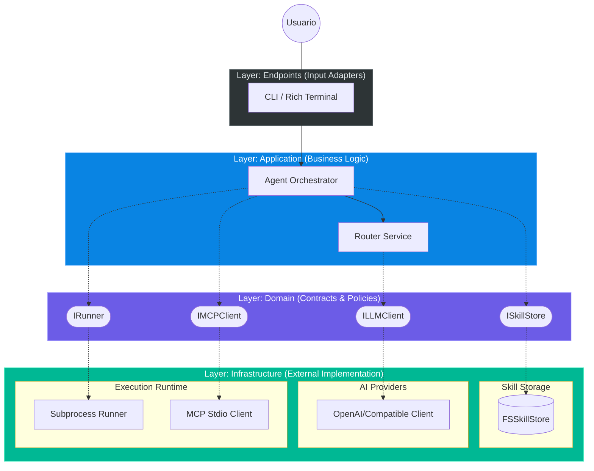
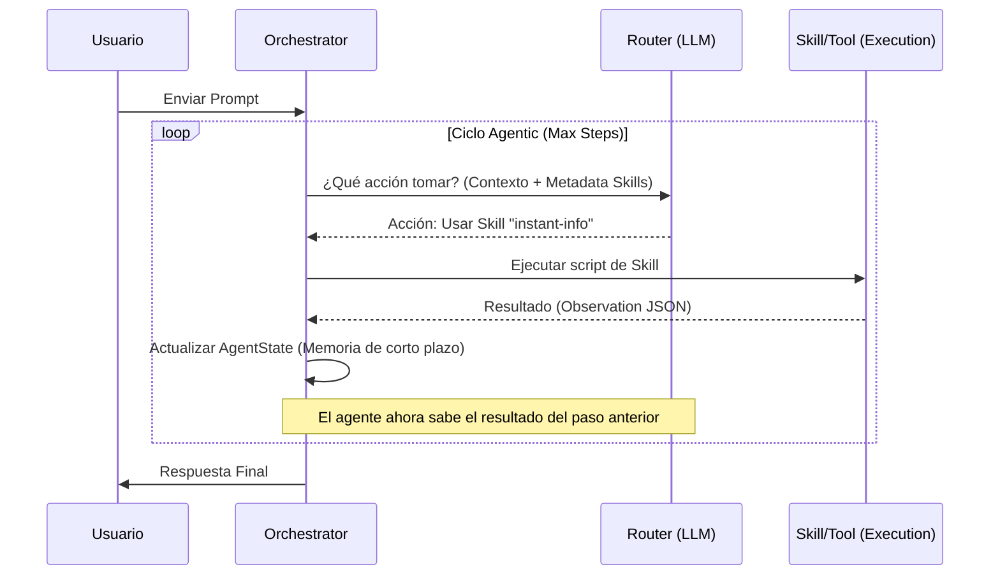
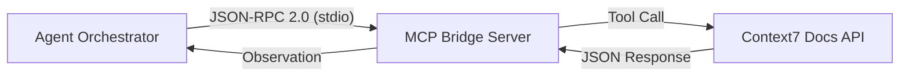

# 🏛️ Arquitectura: Clean Agent Skills Design

Este documento detalla la arquitectura del sistema de agentes basada en **Clean Architecture**, diseñada para ser modular, extensible y eficiente mediante el patrón de **Progressive Disclosure**.

---

## 🎯 Principios de Diseño

1. **Independencia del Framework**: Construido desde cero para una comprensión profunda, sin dependencia de frameworks pesados (No LangChain, No CrewAI).
2. **Decisión ≠ Ejecución**: El Router (LLM) es un cerebro lógico que decide; el Orquestador (Python) es el brazo motor que ejecuta.
3. **Progressive Disclosure**: El contexto se inyecta en "capas" para maximizar la eficiencia del context window.
4. **Stateless POC**: El estado es volátil y reside únicamente en la memoria de la sesión actual.
5. **Contratos Estrictos**: Comunicación entre capas mediante modelos Pydantic e interfaces abstractas.

---

## 🏗️ Estructura de Capas (Hexagonal / Clean)

### 1. Capa de Dominio (`src/core/`)
La capa más interna y pura. Contiene las reglas de negocio y los contratos.
- **`schemas/`**: Modelos de datos (`Action`, `Observation`, `AgentState`). Define qué es una acción y cómo se reporta un resultado.
- **`interfaces/`**: Puertos (Abstract Base Classes) que definen cómo el sistema interactúa con el mundo exterior (LLMs, Filesystem, MCP).
- **`policies.py`**: Reglas duras como `MAX_STEPS` y timeouts de seguridad.

### 2. Capa de Aplicación (`src/services/`)
Orquesta el flujo de datos entre el usuario y las capacidades del agente.
- **`Orchestrator`**: Implementa el loop agentic (Decidir -> Ejecutar -> Observar). No sabe *cómo* se busca en internet, solo sabe que debe pedirle al `Runner` que lo haga.
- **`SkillService`**: Lógica para gestionar el ciclo de vida de las habilidades.

### 3. Capa de Infraestructura (`src/infrastructure/`)
Implementaciones concretas de los puertos definidos en el Core.
- **`llm/`**: Adaptador para APIs compatibles con OpenAI.
- **`storage/`**: Implementación de búsqueda de skills en filesystem.
- **`runners/`**: Ejecutor de scripts locales mediante procesos aislados.
- **`mcp/`**: Cliente para el protocolo Model Context Protocol (stdio).

### 4. Capa de Endpoints (`src/endpoints/`)
Adaptadores de entrada para el usuario.
- **`cli/`**: Interfaz de línea de comandos enriquecida con `Rich`.

---

## 📊 Diagramas de Arquitectura

### Vista General del Sistema (C4 Clean Design)

### Flujo del Loop Agentic (Iterativo)

Este diagrama muestra cómo el agente razona y actúa en ciclos hasta resolver la tarea.

---

## 🧠 Modelo de Skills y Herramientas

El agente combina dos tipos de capacidades para resolver tareas:

1.  **Skills (Habilidades Locales)**: Basadas en archivos del sistema y scripts Python. 
    👉 **[Ver Diseño Detallado de Skills](skills-design.md)**
2.  **Tools (Herramientas Externas)**: Basadas en el estándar MCP.
    👉 **[Ver Integración MCP](mcp-integration.md)**

### Progressive Disclosure (Niveles de Contexto)
Gestionamos el contexto en tres niveles para no saturar el "cerebro" del LLM:

| Nivel | Componente | Cuándo se carga | Propósito |
| :--- | :--- | :--- | :--- |
| **1** | **Metadata** | Siempre (System Prompt) | El Router sabe qué skills existen y para qué sirven. |
| **2** | **SKILL.md** | Solo al elegir la skill | Instrucciones detalladas de uso y contrato de parámetros. |
| **3** | **Resources** | Bajo demanda del agente | Archivos de referencia, documentación técnica o bases de datos locales. |

### Estructura de una Skill
Cada skill en `workspace/skills/` es una unidad autónoma:
- `SKILL.md`: Frontmatter YAML con metadatos + Instrucciones Markdown.
- `scripts/`: Código ejecutable (Python/Bash) que realiza la acción real.
- `references/`: Documentación adicional para el Nivel 3.

---

## 🔌 Integración MCP (Model Context Protocol)

El sistema implementa un cliente **MCP vía stdio** que permite al agente consumir herramientas de servidores externos como si fueran skills locales.

---

## 💾 Gestión de Estado (Transient Memory)

- **Volatilidad**: El estado (`AgentState`) vive en la RAM. Si cierras la CLI, el agente olvida todo.
- **Short-Term Memory**: Durante una sesión, el agente mantiene un historial de mensajes y observaciones para guiar su razonamiento.
- **Seguridad**: El `SubprocessRunner` aísla las ejecuciones de las skills, asegurando que un error en una skill no tumbe al agente.
