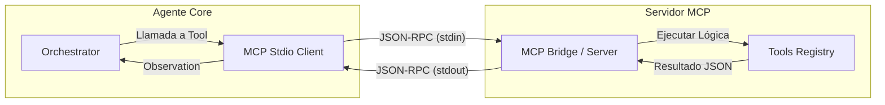
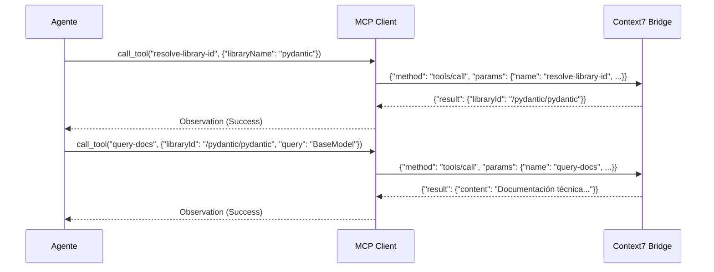

# 🔌 Integración MCP (Model Context Protocol)

Este documento explica cómo el agente utiliza el protocolo **MCP** para extender sus capacidades mediante herramientas externas alojadas en servidores independientes.

---

## 🧐 ¿Por qué MCP?

Mientras que las **Skills** son capacidades locales acopladas al filesystem del agente, el protocolo **MCP** permite:
- Conectar servicios de terceros (Context7, GitHub, Slack).
- Reutilizar herramientas existentes sin reescribir código.
- Escalar la arquitectura de forma distribuida.

---

## 🏗️ Arquitectura del Cliente MCP

Nuestra implementación utiliza el transporte **stdio** (entrada/salida estándar) para comunicarse con los servidores MCP mediante mensajes **JSON-RPC 2.0**.

### Diagrama de Comunicación

---

## 🛠️ Herramientas de Context7 (Ejemplo)

Actualmente, el sistema integra un puente para las herramientas de **Context7**, permitiendo al agente consultar documentación técnica de librerías.

### Flujo de Resolución de Documentación

---

## ⚙️ Configuración y Extensibilidad

Para añadir un nuevo servidor MCP, solo es necesario:
1.  Definir el comando de arranque en el `AppContainer` (`src/bootstrap.py`).
2.  Actualizar el archivo `workspace/tools.md` para que el agente conozca las nuevas herramientas disponibles.
3.  El orquestador gestionará automáticamente el ciclo de vida del proceso hijo (spawn/terminate).
