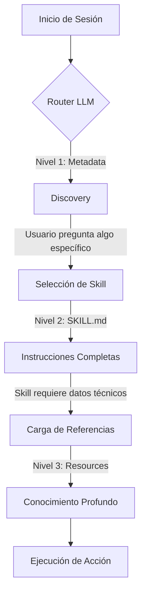
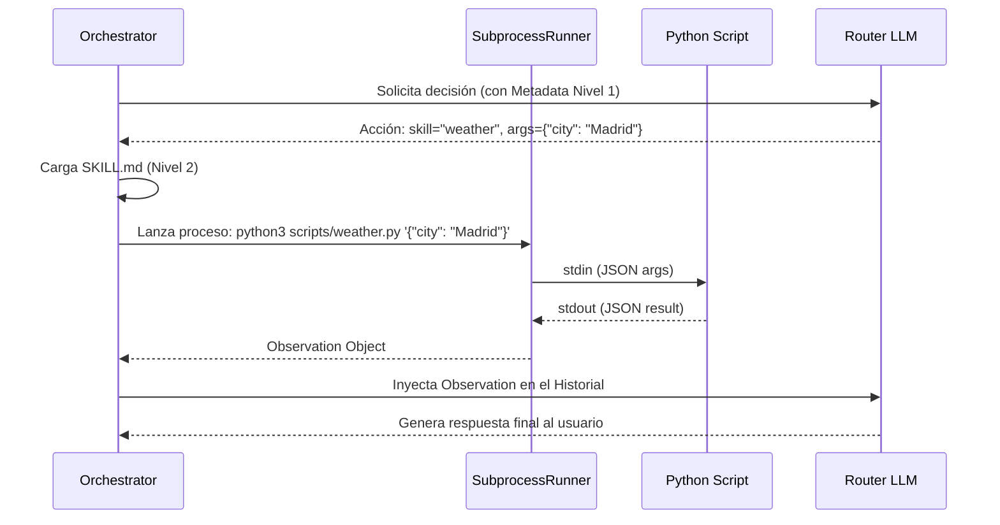

# 🧠 Diseño del Sistema de Skills (Habilidades)

Este documento detalla el funcionamiento interno de las habilidades del agente, siguiendo el patrón de **Progressive Disclosure** (Revelación Progresiva) para optimizar el uso del contexto del LLM.

---

## 🏗️ Estructura de una Skill

Cada habilidad reside en su propio directorio dentro de `workspace/skills/`. Este enfoque modular permite añadir o quitar capacidades sin tocar el código fuente del agente.

```text
workspace/skills/<skill-name>/
├── SKILL.md              # Contrato y guía (Niveles 1 y 2)
├── scripts/              # Brazo motor (Python/Bash)
│   └── main_script.py
└── references/           # Documentación profunda (Nivel 3)
```

---

## 🌊 Flujo de Revelación Progresiva

El sistema gestiona el contexto en tres niveles para evitar la saturación del LLM.

### Diagrama de Flujo de Contexto



### Detalle de los Niveles

| Nivel | Componente | Implementación Técnica | Propósito |
| :--- | :--- | :--- | :--- |
| **1** | **Metadata** | `FSSkillStore.get_all_metadata()` | Proporciona al Router el nombre y la descripción breve de todas las skills para que sepa qué puede hacer. |
| **2** | **Instrucciones** | `FSSkillStore.get_skill_doc()` | Carga el contenido de `SKILL.md` (sin frontmatter). Proporciona el "know-how" y el contrato de parámetros. |
| **3** | **Recursos** | Lectura directa de archivos en `references/` | Información técnica que solo se carga si el agente lo solicita explícitamente tras leer el Nivel 2. |

---

## ⚙️ Ciclo de Ejecución de una Skill

El proceso de ejecución está estrictamente separado del razonamiento para garantizar la seguridad y la estabilidad del sistema.

### Diagrama de Secuencia de Ejecución



---

## 🛠️ Contrato de Datos (Input/Output)

Para mantener la independencia de tecnologías, las skills operan mediante **JSON estándar**:

1.  **Input**: El script recibe los argumentos como una cadena JSON en el primer argumento de línea de comandos (`sys.argv[1]`).
2.  **Output**: El script debe imprimir en `stdout` un objeto JSON válido.
3.  **Aislamiento**: Cada ejecución tiene un tiempo límite (`SKILL_TIMEOUT`) definido en las políticas de dominio.
